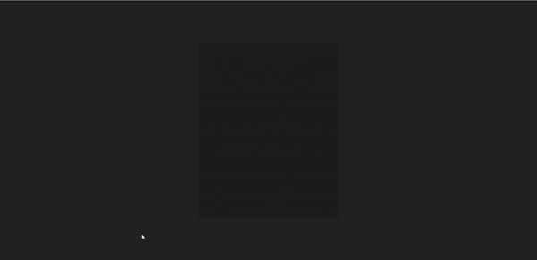

<!-- Banner -->

<a href= "https://danielfraga.dev/" rel="nofollow">

  
<!-- Typing Text -->
  
  
 
   

<!-- SOCIALS -->
 

  

    
    
    
    
  

     
                                                                                               
<!-- ABOUT ME -->

<h2 align="center" color="white">About Me</h2>

I'm a software engineer passionate about using technology to create innovative solutions. My interests include AI, ML, IoT, coding Art, and Data Visualization. I'm fascinated by these specialized facets of coding and how they can be applied to real-world problems. When I'm not coding, I'm likely reading up on the latest tech news or exploring the great outdoors. I'm always looking for new opportunities to learn and grow, so feel free to reach out if you want to chat about tech!

 
                 <!--         Languages & Tools           -->
                 
                 
<h2 align="center" color="white">Languages and Tools</h2>

MERN Stack | JavaScript, React, Express, Node, MongoDB

 
 

<!-- My Work -->

<h2 align="center">My Work</h2>
<table bordercolor="#66b2b2">
  <tr>
    <td width="50%" valign="top">
        <h3 align="center">PNG Pixel Shower</h3>
         
        
         
        

              
            	
        

        
<strong>HTML5, CSS, Javascript, CanvaAPI</strong> - PNG Pixel Shower showcases pixel art generated using the Canva API. Each pixel is a random color and forms a beautiful PNG image. 

    </td>
    <td width="50%" valign="top">
        <h3 align="center">Random Color Hoverboard</h3>
         
        
         
        

              
            	
        

        
<strong>HTML5, CSS, and Javascript</strong> -  The hoverboard app, where users can mouse over each block to reveal a random color. The colors fade out gradually when the mouse leaves the block, creating a dynamic and interactive experience. 

    </td>
  </tr>  
  <tr>
    <td width="50%" valign="top">
        <h3 align="center">Natours| Touring the Outdoors</h3>
         
        
         
        

              
            	
        

        
<strong>HTML, CSS, Sass, Javascript</strong> - Natours offers a variety of outdoor tours for nature enthusiasts. Tours include guided hikes, wildlife watching, camping trips, and more. Specializing in creating unique and memorable experiences that showcase the natural beauty of nature. Offering educational adventures for all skill levels! 

    </td>
    <td width="50%" valign="top">
        <h3 align="center">Password Strength App</h3>
         
        
         
        

              
            	
        

        
<strong>HTML5, CSS, and Javascript</strong> - Login application uses a unique password strength feature. As users type their password, the background image becomes clearer, providing visual feedback on password strength. This helps users create more secure passwords and reduces the risk of unauthorized access.  

    </td>
  </tr>
</table>

<!-- SOCIALS -->
 
<h2 align="center" color="white">Connect with Me</h2>

  

    
    
    
    
  

                                                                                                       
